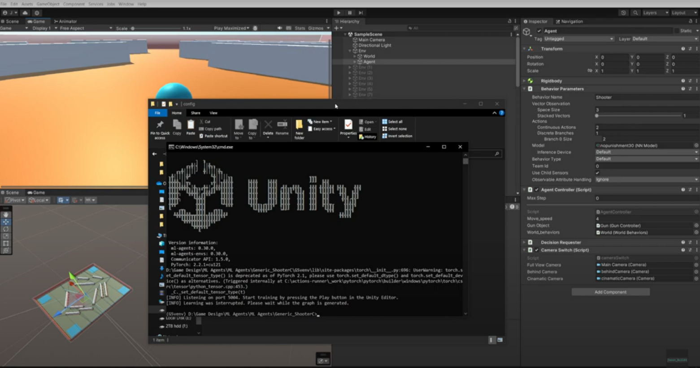
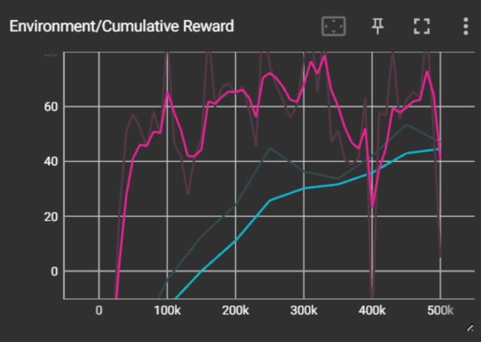
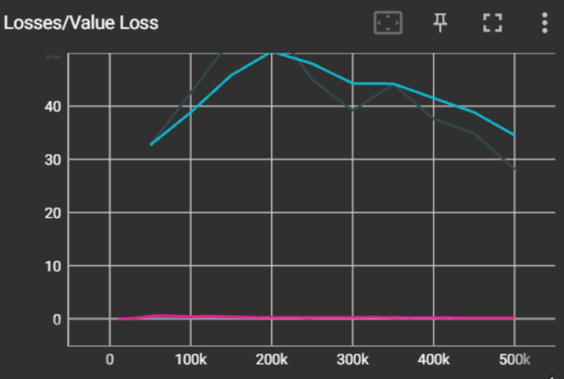
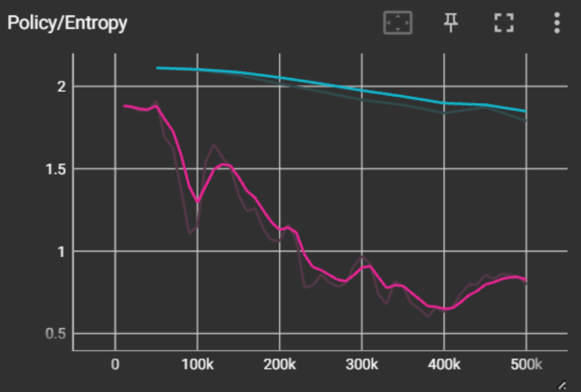

# RL-FPS-Shooter

A Reinforcement Learning-based First-Person Shooter (FPS) game where an AI agent, trained using **Proximal Policy Optimization (PPO)**, autonomously learns to move, aim, and shoot at zombies. Built using **Unity**, **ML-Agents**, and **Python**.

## 📸 Screenshots & Visuals

| Training the Agent | PPO vs SAC Average Reward |
|--------------------|---------------------------|
|  |  |

| Critic/Value Loss Comparison | Policy Entropy |
|------------------------------|----------------|
|  |  |

## 📌 Features
- **AI-controlled agent** trained using PPO to autonomously navigate and eliminate zombies.
- **Fully autonomous gameplay**, where the agent controls both movement and shooting.
- **Reinforcement Learning training pipeline** optimized for FPS gameplay.
- **Dynamic obstacles and cover mechanics** for strategic AI behavior.
- **Real-time FPS gameplay** with adaptive AI decision-making.

## 🆕 Recent Updates
- Improved agent movement controls for better responsiveness.
- Added minor optimizations to zombie spawning logic.

## 🚀 Setup Instructions

### 1️⃣ Clone the Repository
```sh
git clone https://github.com/TarunKumarRevelli/RL-FPS-Shooter.git
cd RL-FPS-Shooter
```

### 2️⃣ Install Dependencies
- **Unity Hub** (Recommended: Unity 2021 or later)
- **ML-Agents Toolkit** for training the AI agent
- **Python 3.8+** with dependencies:
  ```sh
  pip install mlagents torch numpy matplotlib
  ```

### 3️⃣ Open in Unity
1. Open **Unity Hub**.
2. Click **Add Project** and select the `RL-FPS-Shooter` folder.
3. Open the project and ensure all assets load properly.

### 4️⃣ Train the AI Agent (PPO Training)
1. Open a terminal inside the project directory.
2. Run:
   ```sh
   mlagents-learn config/trainer_config.yaml --run-id=FPS-Agent --train
   ```
3. The AI will start training using the following **PPO hyperparameters**:
   ```yaml
   behaviors:
     Shooter:
       trainer_type: ppo
       hyperparameters:
         batch_size: 1024
         buffer_size: 10240
         learning_rate: 0.0003
         beta: 0.005
         epsilon: 0.2
         lambd: 0.95
         num_epoch: 3
         shared_critic: False
         learning_rate_schedule: linear
         beta_schedule: linear
         epsilon_schedule: linear
       network_settings:
         normalize: False
         hidden_units: 128
         num_layers: 2
         vis_encode_type: simple
         deterministic: False
       reward_signals:
         extrinsic:
           gamma: 0.99
           strength: 1.0
           network_settings:
             normalize: False
             hidden_units: 128
             num_layers: 2
             vis_encode_type: simple
             deterministic: False
       keep_checkpoints: 5
       checkpoint_interval: 500000
       max_steps: 500000
       time_horizon: 64
       summary_freq: 50000
       threaded: False
   ```

### 5️⃣ Play the Game
- Run the Unity scene `FPS_Shooter.unity` to start playing.
- The AI-controlled agent will **autonomously move, aim, and shoot at zombies**.
- The agent continuously improves its accuracy and strategy based on training feedback.

## 📝 Contributors
- **[Tarun Kumar Revelli](https://github.com/TarunKumarRevelli)**
- **[Saatvik Prabhu](https://github.com/sevenweeks-07)**